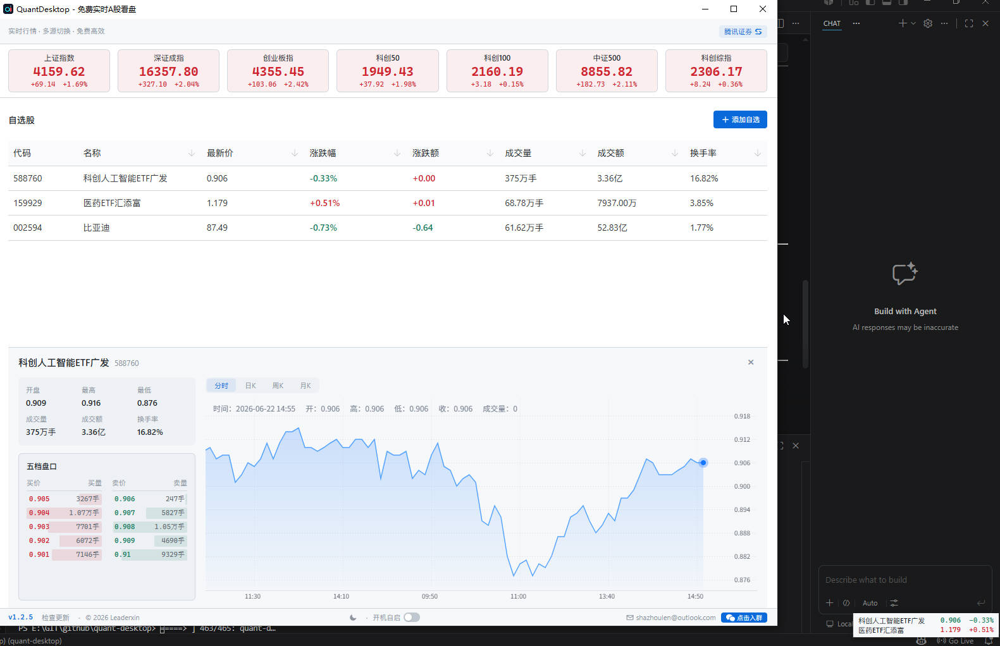
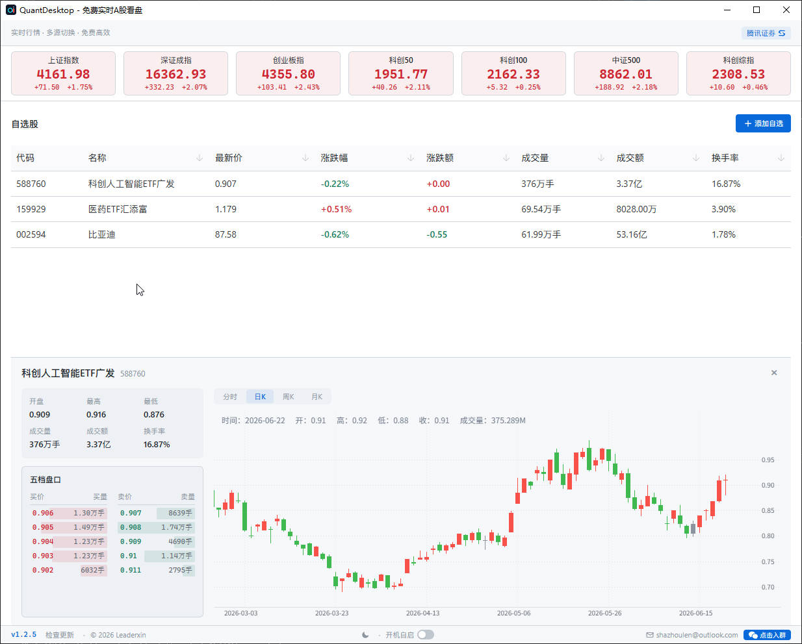
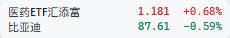

# QuantDesktop

> 🚀 **免费 · 专业 · 零打扰** —— 桌面级 A 股实时行情监控工具

  
   
  👆 扫码加入用户交流群

---

## 💡 你是否遇到过这些痛点？

- 上班时偷偷看盘，浏览器切来切去太显眼
- 手机盯盘效率低，K 线图太小看不清
- 付费软件年费几百上千，功能虽多但真正用上的没几个
- 装个看盘软件附带一堆广告弹窗、理财推荐

**QuantDesktop** 正是为解决这些问题而生 —— 一款真正**免费、轻量、专业**的桌面级 A 股行情监控工具。

---

## ✨ 什么是 QuantDesktop？

QuantDesktop 是一款轻量级的桌面端 A 股行情监控工具，支持 **Windows / macOS / Linux** 三大平台。它从腾讯证券、新浪财经等公开数据源实时拉取行情，**完全免费，无需注册，开箱即用**。

> 🏗️ **轻量高效**：安装包体积仅几 MB，运行时内存占用极低，不会拖慢你的电脑。

<!-- TODO: 替换为主窗口完整截图，展示：指数栏 + 自选表格 + 详情面板 + 底部状态栏 -->

---

## 📊 核心功能

### 实时行情 + 大盘指数

- **自选股批量刷新** —— 现价、涨跌幅、涨跌额、开/高/低、成交量、成交额、换手率，一览无余
- **七大指数同步展示** —— 上证、深证、创业板指、科创 50、科创 100、中证 500、科创综指实时更新
- **智能自适应轮询** —— 交易时段 2 秒快速刷新，盘前盘后自动降频，节假日智能休眠，不浪费带宽和电量

### 专业图表分析

- **分时走势图** —— 盘中每分钟自动刷新，完整记录当日走势
- **K 线图（日 / 周 / 月）** —— 蜡烛图严格遵循 A 股红涨绿跌习惯，成交量副图量价联动
- **五档盘口** —— 买一至买五、卖一至卖五实时展示，3 秒自动刷新

<!-- TODO: 替换为个股详情面板截图，同时展示 K线图 + 成交量副图 -->

### 自选股管理

- 添加、删除、排序（置顶 / 上移 / 下移），右键菜单快捷操作
- 输入 6 位股票代码即时搜索，支持跨数据源智能回退
- 按涨跌幅、价格、成交量、代码等任意列排序

### 双数据源自动切换

顶栏一键切换腾讯证券（默认）或新浪财经（备用），切换后即时刷新，零等待。

---

## 🌟 杀手锏功能

### 一、🖱️ 可拖拽的浮动行情条

这是 QuantDesktop **最受欢迎的功能**。

桌面右下角会显示一个迷你的行情条：

- ✅ **始终置顶**在所有窗口之上，无边框设计，不占任务栏空间
- ✅ **每 3 秒自动轮播** 2 只自选股，显示股票名称、最新价和涨跌幅
- ✅ **鼠标悬停暂停**，方便你仔细看某只股票
- ✅ **直接拖拽**到桌面任意位置，丝滑零延迟
- ✅ **点击恢复主窗口**，快速切换到完整看盘界面
- ✅ **主题同步** —— 深色/浅色切换，行情条同步响应

<!-- TODO: 替换为行情条截图，展示浮在其他窗口之上的效果 -->

> 💡 **典型场景**：把行情条拖到屏幕角落或副屏边缘，工作时余光一扫就能掌握自选股动态。比任何"老板键"都优雅 —— 因为**它看起来就像桌面的一部分**。

### 二、📌 系统托盘常驻

- 关闭主窗口**不退出程序**，自动最小化到系统托盘
- 左键托盘图标 → 显示/隐藏主窗口
- 右键菜单 → 显示主窗口 / 切换行情条 / 退出
- 支持**开机自启**，设为默认后台常驻

> 💡 早上开机，QuantDesktop 自动启动并缩在托盘里，行情条浮在桌面上。你不需要"打开看盘软件"这个动作 —— **行情一直在那儿**。

### 三、🧠 窗口位置记忆

主窗口位置和大小自动保存，重启恢复原位。即使更换显示器也会智能检测边界，不会跑到屏幕外面去。

### 四、⚡ 离线缓存

行情数据自动写入本地缓存。重启应用时**立即恢复上一次报价**，无需等待网络请求 —— 打开就是最新行情。

### 五、⏰ 交易时段智能感知

| 时段 | 轮询频率 | 说明 |
|------|----------|------|
| 开盘快速探测 | 2 秒 × 3 次 | 确认交易是否活跃 |
| 正常交易 | 2 秒 | 实时跟踪价格变化 |
| 盘前 / 午休 | 5~10 秒 | 适度降频 |
| 连续无变化 | 30 秒 | 自动进入空闲态 |
| 节假日 / 周末 | 30 秒 | 智能休眠 |

自动更新提示也会在交易时段**智能抑制弹窗**，避免打断你盯盘。

---

## 🎨 界面设计

- **深色 / 浅色主题**一键切换，白天黑夜都护眼
- **等宽数字字体**，价格和涨跌幅列完美对齐
- **A 股配色习惯** —— 红涨绿跌，一目了然
- 界面简洁流畅，无冗余元素干扰

---

## 📦 安装与使用

### 下载

前往 [GitHub Releases](https://github.com/Leaderxin/quant-desktop/releases) 下载最新版本：

| 平台 | 安装包格式 |
|------|-----------|
| Windows | `.exe` / `.msi` |
| macOS | `.dmg` |
| Linux | `.deb` / `.AppImage` |

### 三步开始看盘

1. **安装并启动** —— 首次启动自动创建数据库和默认配置
2. **添加自选股** —— 点击"添加股票"，输入 6 位代码（如 `600519` 贵州茅台），搜索并添加
3. **开始看盘** —— 主窗口查看完整行情，行情条常驻桌面后台监控

---

## 🗺️ 路线图

### ✅ 已完成

- [x] 实时行情 + 七大指数
- [x] 分时图 + K 线图（日/周/月）+ 成交量副图
- [x] 五档盘口（3s 自动刷新）
- [x] 浮动行情条（拖拽、轮播、主题同步）
- [x] 系统托盘常驻 + 开机自启
- [x] 自选股增删改查 + 排序 + 搜索
- [x] 深色 / 浅色主题
- [x] 窗口位置记忆 + 离线缓存
- [x] 自适应轮询 + 交易时段感知
- [x] 自动更新 + 交易时段弹窗抑制

### 📋 规划中

- [ ] 技术指标叠加（MA / BOLL / MACD）
- [ ] 价格预警通知
- [ ] 自选股导入 / 导出（JSON / CSV）
- [ ] 港股 / 美股市场支持
- [ ] 专业数据源接入（Wind / Tushare）

---

## 🤝 开源与贡献

QuantDesktop 完全开源，源码可见，自由使用、修改和分享。

- **GitHub 仓库**：[Leaderxin/quant-desktop](https://github.com/Leaderxin/quant-desktop)
- **Bug 反馈 & 功能建议**：欢迎提交 [Issue](https://github.com/Leaderxin/quant-desktop/issues)
- **想参与开发？** 欢迎提交 PR，一起把工具做得更好

---

## 💬 结语

QuantDesktop 的核心理念是 **"不打扰的看盘"**：

> 不需要打开浏览器 · 不需要付费订阅 · 不需要笨重的客户端

一个安静的系统托盘图标 + 一个可拖拽到任意位置的迷你行情条 + 需要时一键展开的完整看盘界面 —— **这就是 QuantDesktop 给你的一切**。

如果你也是 A 股投资者，不妨试试看。完全免费，没有捆绑，不用注册。如果觉得好用，欢迎给个 **Star ⭐** 支持一下！

---

  <b>QuantDesktop v1.2.6</b> — 免费实时 A 股看盘，从桌面开始。

