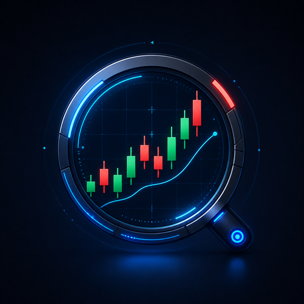
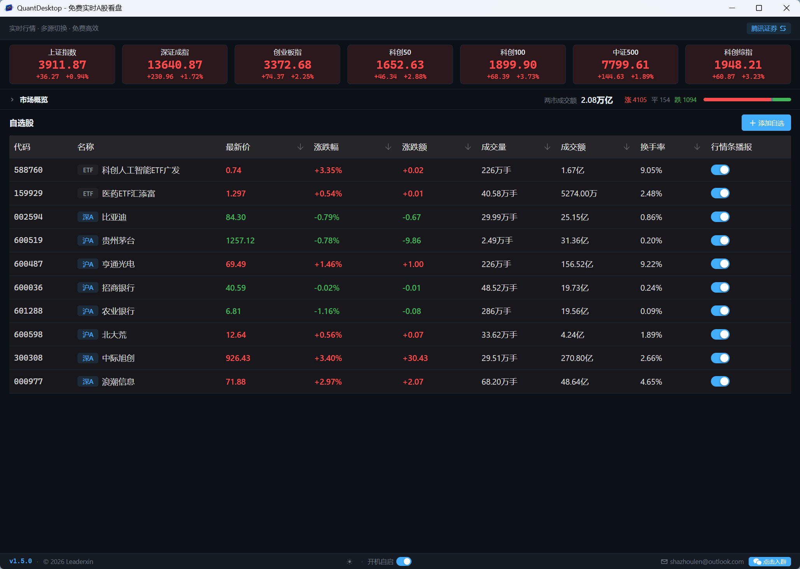
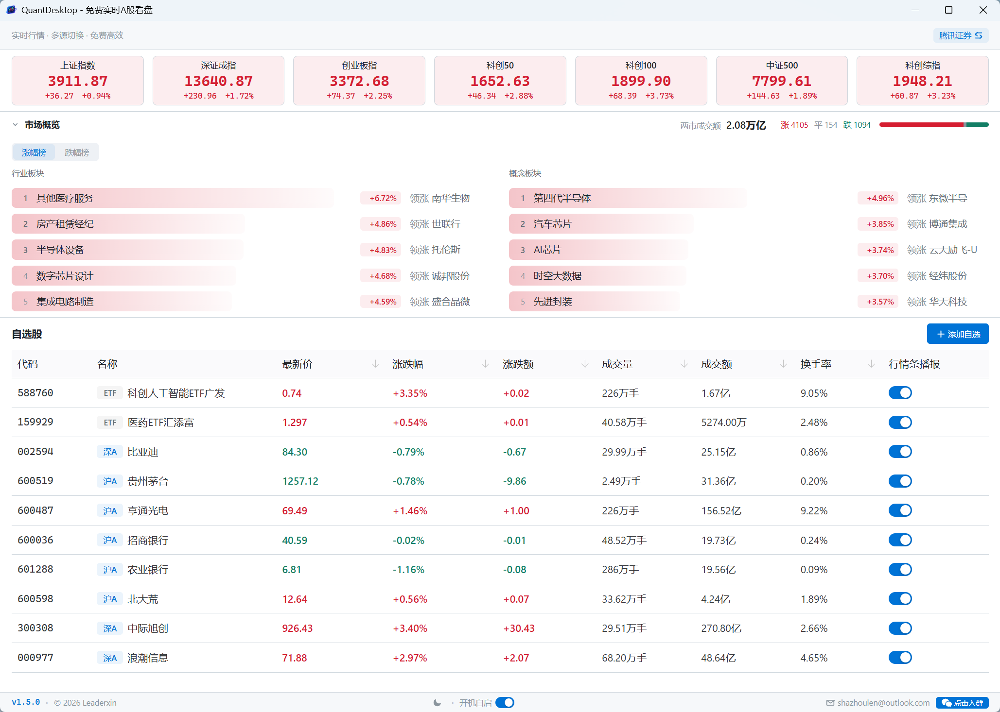
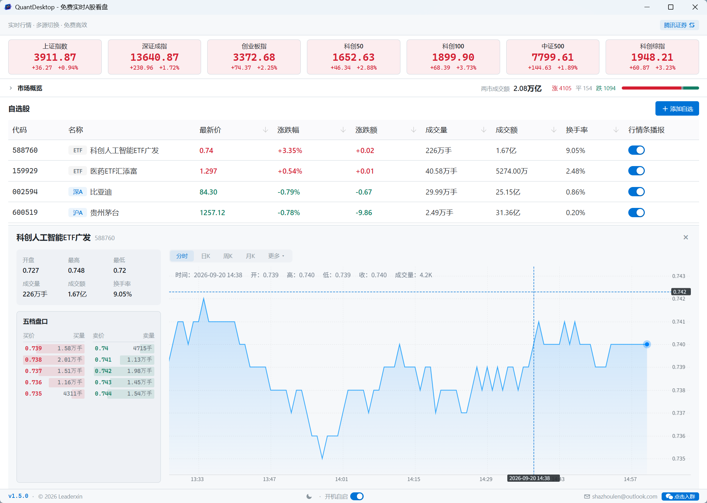
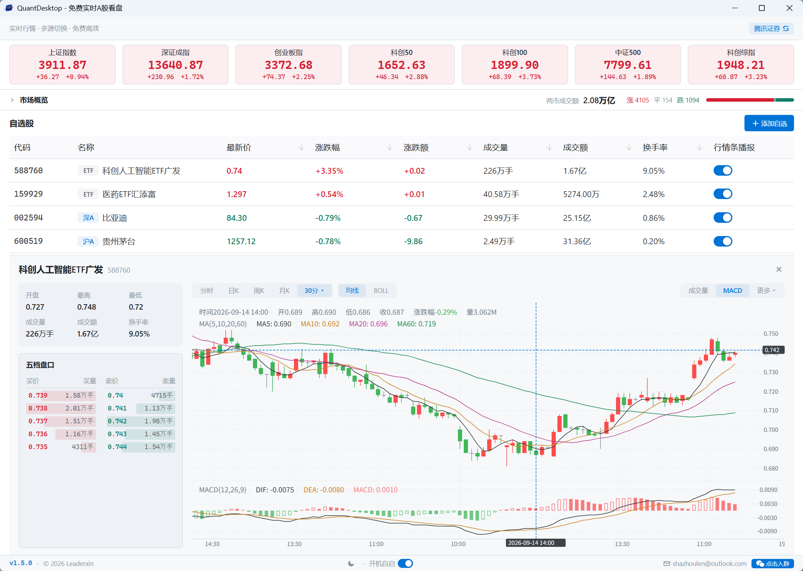
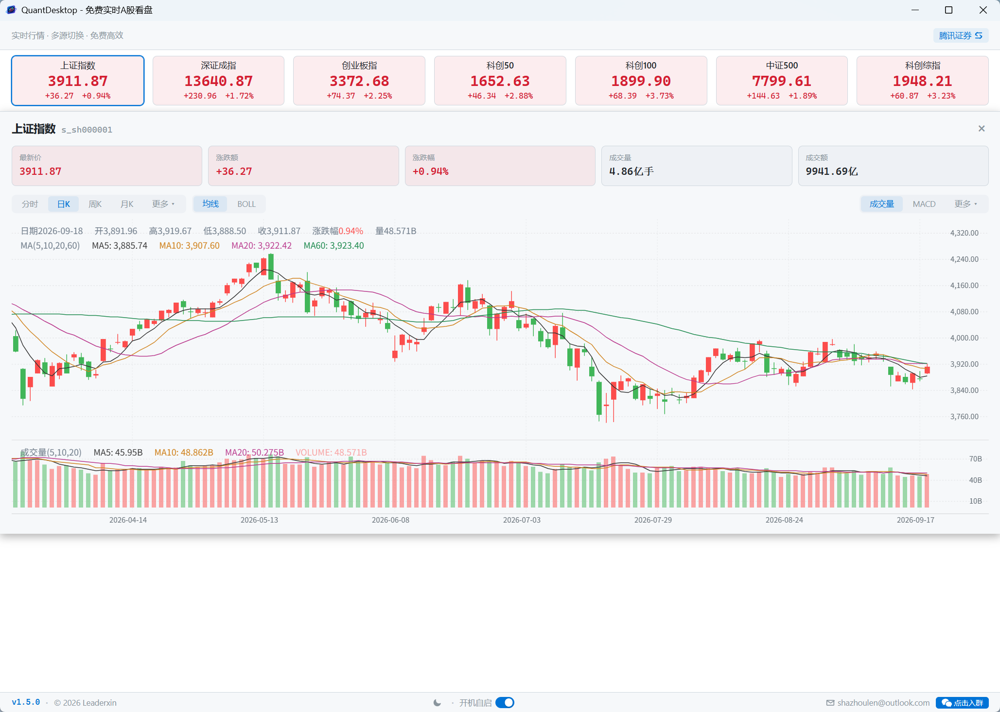
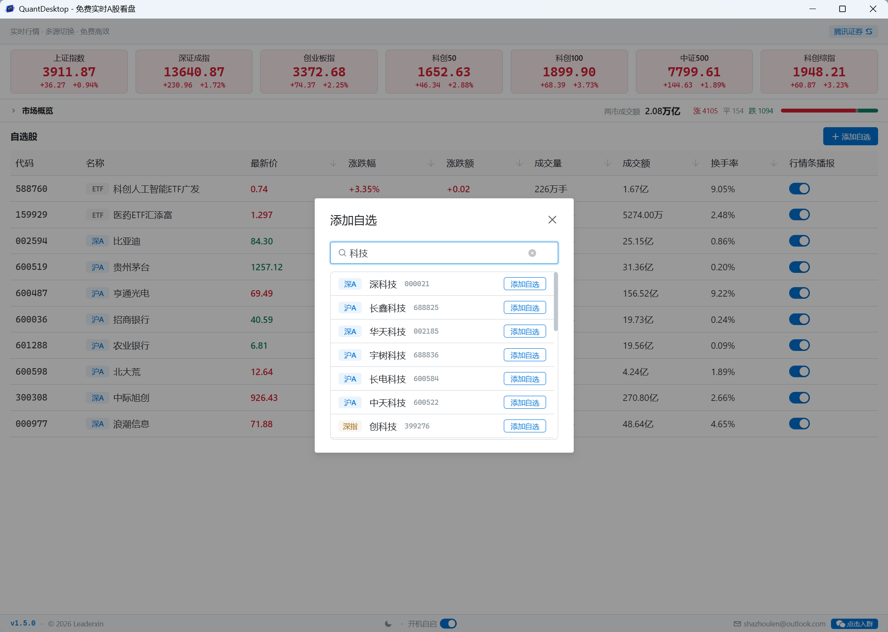
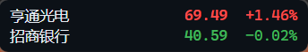
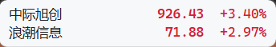
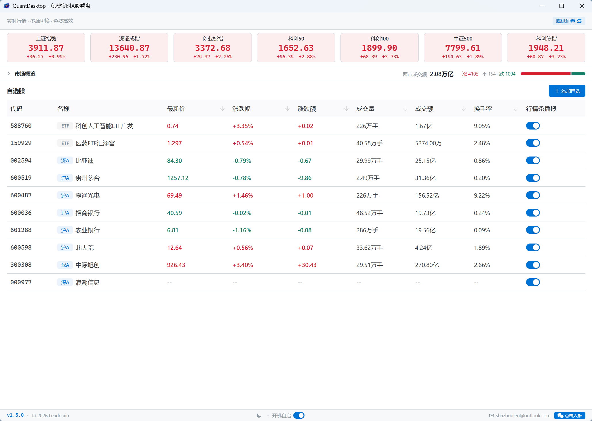

# QuantDesktop

**免费 · 开源 · 零打扰** —— 桌面级 A 股实时行情看盘工具

*让看盘更安静一点*

<b>主界面 · 夜间主题</b> —— 指数栏 · 涨跌概览 · 自选列表，一屏尽览

---

## 💡 为什么是 QuantDesktop？

你是否也遇到过：

- 😎 上班想瞄一眼行情，浏览器切来切去太显眼，手机盯盘屏幕又太小
- 💸 付费行情软件年费几百上千，功能一大堆，常用的就那几个
- 📢 看盘工具广告弹窗满天飞，还顺手推销理财产品
- 🐢 装个「专业客户端」动辄几个 G，越用越卡

**QuantDesktop** 把「看盘」这一件事做到极致的简单：

| | |
|---|---|
| 🆓 **完全免费** | 无需注册、无广告、无弹窗、不推销理财 |
| 🪶 **极致轻量** | Windows 安装包 **不到 5 MB**，冷启动秒开，常驻后台几乎无感 |
| 📈 **专业看盘** | 实时行情 · 分时 · 多周期 K 线 · 五档盘口 · 板块排行 |
| 🖥 **三端覆盖** | Windows / macOS / Linux 全平台支持 |
| 🔒 **隐私安全** | 数据全部存在本机，不注册账号、不采集任何个人信息 |

---

## ✨ 功能亮点

### 1️⃣ 市场全景，一屏掌握

- **七大指数实时刷新** —— 上证指数、深证成指、创业板指、科创 50、科创 100、中证 500、科创综指，点击任一指数展开指数详情
- **涨跌速览** —— 上涨 / 下跌 / 平盘、涨停 / 跌停家数常驻主界面，市场情绪一眼看清
- **市场概览面板** —— 两市成交额、全市场涨跌分布直方图、行业与概念板块涨跌排行，热点在哪里一目了然

<b>市场概览面板</b> —— 涨跌分布 · 两市成交额 · 行业 / 概念板块排行

### 2️⃣ 专业图表，从分时到月 K

- **分时走势** —— 1 分钟粒度 + 均价线 + 量能副图，打开期间每 5 秒增量刷新，不闪烁
- **K 线周期全覆盖** —— 日 / 周 / 月 / 1 / 5 / 15 / 30 / 60 分钟，自由切换
- **主图指标** —— MA 均线 / BOLL 布林带一键切换
- **副图指标** —— 成交量（含 MA5 / MA10 / MA20 均量线）/ MACD 一键切换
- **左滑加载历史** —— K 线图向左滑动查看更早数据
- **A 股习惯配色** —— 红涨绿跌，悬停 tooltip 查看涨跌幅
- **指数也有详情** —— 点击指数卡片，查看指数专属分时图与 K 线

<table>
<tr>
<td width="50%">

<b>分时走势 + 五档盘口</b> 盘口每 3 秒静默刷新，附带开 / 高 / 低 / 量 / 额 / 换手率概要

</td>
<td width="50%">

<b>分钟 K 线 + 副图指标</b> 主图 MA / BOLL 切换，副图成交量 / MACD 切换

</td>
</tr>
</table>

<b>指数详情</b> —— 上证指数日 K，均线与量能一应俱全

### 3️⃣ 自选管理，简单直接

- 输入 6 位代码即时搜索，**市场标签**（沪A / 深A / 北A / 沪指 / ETF…）让同代码的指数与个股一眼可辨
- 覆盖沪深京三市个股、指数与 ETF
- 置顶 / 上移 / 下移 / 删除，右键菜单快捷操作
- 按涨跌幅、价格、成交量、代码等任意列排序
- 跨数据源智能回退：一个源搜不到，自动换源再试

<b>添加自选</b> —— 代码搜索 + 市场标签，同码指数与个股不再混淆

### 4️⃣ 悬浮行情条 —— 上班族的「余光看盘」

这是 QuantDesktop **最受欢迎的功能**：一枚常驻桌面的迷你行情条。

- 📌 **始终置顶**于所有窗口，无边框、不占任务栏
- 🔄 每 3 秒自动轮播 2 只自选股：名称 / 现价 / 涨跌幅
- ⏸ 鼠标悬停自动暂停，看清楚了再走
- 🖱 **直接拖拽**到桌面任意位置 —— 拖到哪儿，下次启动还出现在哪儿（位置自动记忆）
- 🎯 可在自选表中**逐只开关**某只股票是否参与播报
- 🌓 深浅主题实时同步
- 👆 单击行情条，立即恢复主窗口

<table>
<tr>
<td align="center" width="50%">

<b>夜间主题</b>

</td>
<td align="center" width="50%">

<b>日间主题</b>

</td>
</tr>
</table>

> 💡 **典型场景**：把行情条拖到副屏边缘或任务栏旁，工作时余光一扫即可掌握自选股动态。比任何「老板键」都优雅 —— 因为它看起来就像桌面的一部分。

### 5️⃣ 深浅双主题

- 深色 / 浅色一键切换，主窗口与行情条实时同步
- 等宽数字字体，价格与涨跌幅列完美对齐
- 红涨绿跌，符合 A 股配色习惯

<table>
<tr>
<td width="50%">

<b>夜间主题</b> —— 默认

</td>
<td width="50%">

<b>日间主题</b>

</td>
</tr>
</table>

---

## 🧠 看不见的功夫

> 好工具的体验，藏在看不见的细节里。

**智能自适应轮询** —— 按交易时段自动调节刷新频率，快慢有度，不浪费一滴带宽和电量：

| 时段 | 轮询频率 | 说明 |
|------|----------|------|
| 开盘快速探测 | 2 秒 × 3 次 | 确认交易是否活跃 |
| 正常交易 | 2 秒 | 实时跟踪价格变化 |
| 盘前 / 午休 | 5~10 秒 | 适度降频 |
| 连续无变化 | 30 秒 | 自动进入空闲态 |
| 节假日 / 周末 | 30 秒 | 智能休眠 |

**更多细节**：

- 🔌 **双数据源** —— 腾讯证券（默认）+ 新浪财经（备用），顶栏一键切换、即时刷新；单源接口异常自动回退
- 💾 **离线缓存** —— 行情数据写入本地 SQLite，重启立即恢复上次报价，打开就有数据，不用等网络
- 🪟 **窗口位置记忆** —— 主窗口与行情条的位置、大小自动保存，重启原位恢复，跨显示器自动边界保护
- 🫥 **托盘常驻** —— 关闭窗口不退出，安静缩到系统托盘；支持开机自启
- 🔄 **自动更新** —— 新版本自动检测、一键安装，交易时段智能抑制弹窗，不打断盯盘

---

## 📦 下载安装

### 下载

前往 [GitHub Releases](https://github.com/Leaderxin/quant-desktop/releases/latest) 下载最新版本，或从 [Microsoft Store](https://apps.microsoft.com/detail/9P46MZZDTTZ0) 安装（商店版自动跟随商店更新）：

| 平台 | 安装包 | 体积 | 说明 |
|------|--------|------|------|
| Windows | `x64-setup.exe` | ~5 MB | NSIS 安装版（推荐） |
| Windows | `x64-portable.zip` | ~7 MB | 便携版，解压即用，不写注册表 |
| macOS | `universal.dmg` | ~16 MB | Intel + Apple Silicon 通用 |
| Linux | `amd64.deb` / `.rpm` | ~8 MB | Debian / Ubuntu / Fedora 等 |
| Linux | `AppImage` | ~83 MB | 自带依赖，全发行版通用 |

### 三步开始看盘

1. **安装启动** —— 首次运行自动初始化，无需任何配置
2. **添加自选** —— 点击「添加股票」，输入 6 位代码（如 `600519` 贵州茅台）搜索添加
3. **开始看盘** —— 主窗口看全局，行情条挂在桌面角落默默播报

---

## 🏗️ 技术架构

QuantDesktop 基于 **Tauri 2 + Rust + Vue 3** 构建 —— 与开源项目 [CC Switch](https://github.com/farion1231/cc-switch) 同款技术底座。Rust 后端负责行情抓取、SQLite 存储与自适应调度，Vue 3 前端驱动主窗口与悬浮行情条两个独立窗口。同样的功能，Electron 应用通常 80 MB 起步，QuantDesktop 安装包只有几 MB。

| 层 | 技术 |
|---|------|
| 桌面框架 | Tauri 2 |
| 后端 | Rust · tokio · rusqlite · reqwest |
| 前端 | Vue 3 · Pinia · Naive UI · klinecharts |
| 数据源 | 腾讯证券 · 新浪财经（可插拔适配器架构） |

---

## 🗺️ 路线图

**✅ 已完成**

- [x] 实时行情 + 七大指数 + 市场概览（涨跌分布 / 板块排行）
- [x] 分时图 + K 线图（日 / 周 / 月 + 1 / 5 / 15 / 30 / 60 分钟）
- [x] 主图 MA / BOLL、副图成交量 / MACD 指标切换
- [x] K 线图左滑加载历史数据
- [x] 五档盘口（3 秒静默刷新）
- [x] 悬浮行情条（拖拽 / 轮播 / 逐只播报开关 / 位置记忆）
- [x] 系统托盘常驻 + 开机自启
- [x] 自选股增删改查 + 排序 + 跨数据源搜索
- [x] 北交所支持 + Microsoft Store 上架
- [x] 深色 / 浅色主题
- [x] 窗口位置记忆 + 离线缓存
- [x] 自适应轮询 + 交易时段感知
- [x] 自动更新 + 交易时段弹窗抑制

**📋 规划中**

- [ ] 价格预警通知
- [ ] 丰富灵活的自定义参数配置
- [ ] 港股 / 美股市场支持

---

## ❓ 常见问题

**Q：行情数据从哪里来？可靠吗？**

来自腾讯证券与新浪财经的公开行情接口，双数据源互为备份，接口异常自动回退。数据仅供个人参考，不构成投资建议。

**Q：真的完全免费吗？**

个人使用完全免费。项目采用 [PolyForm Noncommercial](LICENSE) 非商业开源许可 —— 你可以自由使用、学习和修改，商业使用需获得作者授权。

**Q：需要注册账号吗？会收集我的数据吗？**

不需要任何账号。自选与配置数据仅存储在本地 SQLite 数据库，不采集、不上传任何个人信息。详见[隐私说明](docs/privacy.html)。

**Q：支持哪些系统？**

Windows 10 / 11、macOS（Intel + Apple Silicon）、Linux（Ubuntu 22.04+ / glibc 2.35+ 基线）。

---

## 🤝 贡献与交流

- **Bug 反馈 / 功能建议**：欢迎提交 [Issue](https://github.com/Leaderxin/quant-desktop/issues)
- **参与开发**：欢迎提交 PR —— 前端（Vue 3）与后端（Rust）均有类型检查与单元测试把关
- **更新日志**：[CHANGELOG.md](CHANGELOG.md)
- **用户交流群**：

  
   
  扫码加入用户交流群

---

## ⭐ Star History

---

## 📄 开源许可

本项目基于 [PolyForm Noncommercial License 1.0.0](LICENSE) 开源：

- ✅ 个人使用、学习、修改、分发 —— 免费
- ❌ 商业使用 —— 需获得作者授权

---

**如果 QuantDesktop 对你有用，欢迎点一个 ⭐ Star —— 这是持续开发的动力！**

QuantDesktop v1.5.1 · 让看盘更安静一点

