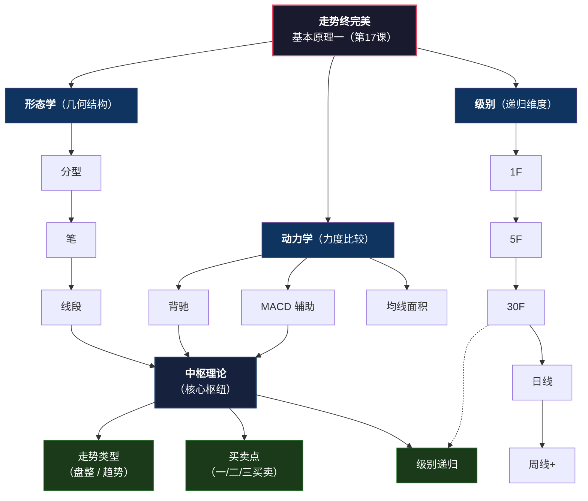
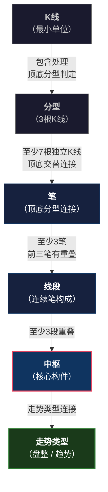
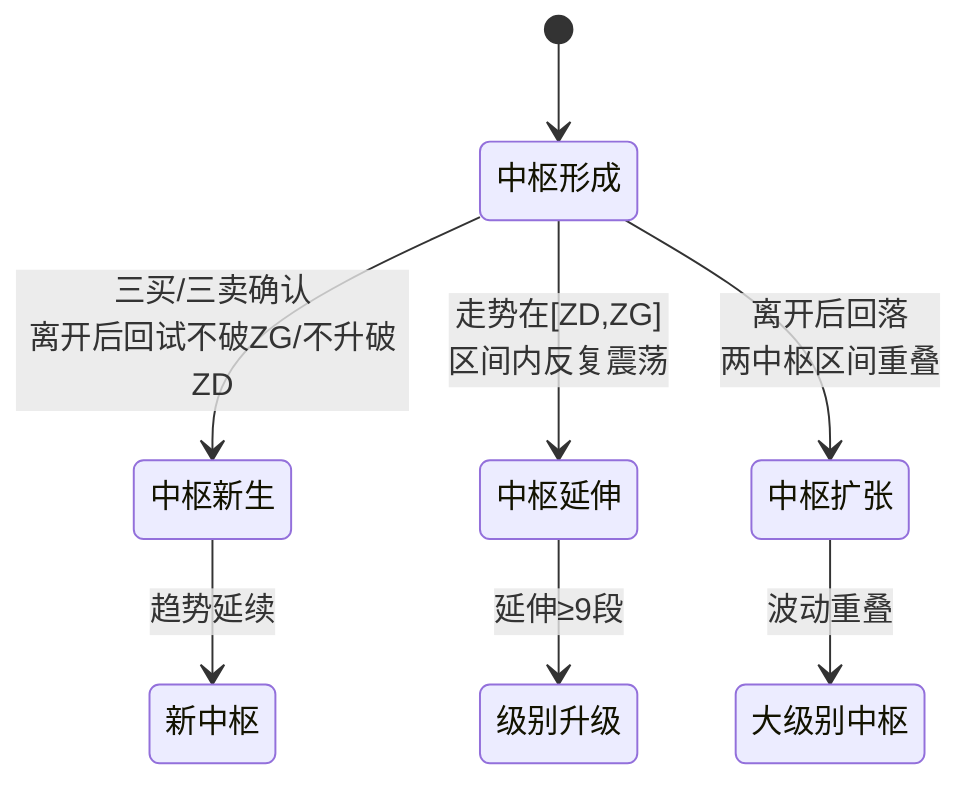
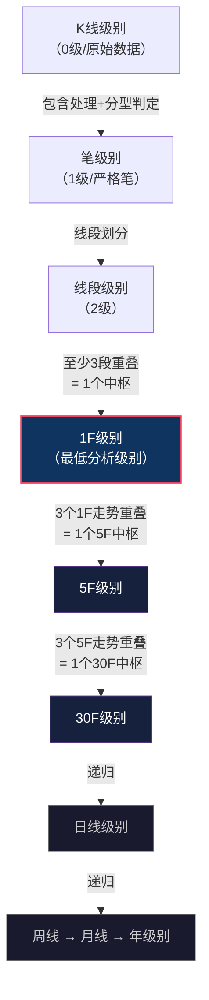
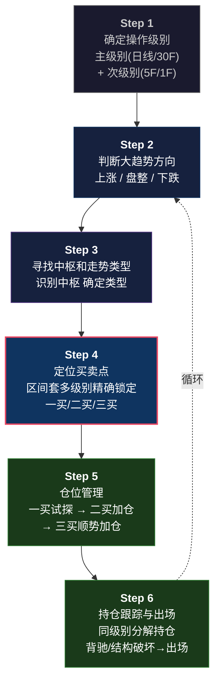

# 缠论核心理论体系

> 基于缠中说禅新浪博客《教你炒股票》108课原文总结归纳
>
> 理论创立者：缠中说禅（2006-2007） | 文档版本：v1.0

---

## 目录

1. [缠论概述](#一缠论概述)
2. [理论基础：分型、笔、线段](#二理论基础分型笔线段)
3. [中枢理论](#三中枢理论)
4. [走势类型与级别](#四走势类型与级别)
5. [三类买卖点](#五三类买卖点)
6. [背驰判断（MACD辅助）](#六背驰判断macd辅助)
7. [区间套原理](#七区间套原理)
8. [同级别分解](#八同级别分解)
9. [走势终完美](#九走势终完美)
10. [实战应用框架](#十实战应用框架)
11. [参考资料](#参考资料)

---

## 一、缠论概述

### 1.1 理论定位

缠中说禅走势理论（简称"缠论"）是一套**完全基于市场自身走势结构**的技术分析体系。与传统指标分析不同，缠论不依赖于任何外部变量，而是**直接从价格走势的几何形态中**提取交易信号。

缠论的核心哲学命题是：**"走势终完美"**——任何级别的任何走势类型，最终都要完成。这是整个理论大厦的基石，也是所有买卖点存在的根本保障。

### 1.2 理论架构全景

**三个独立维度：**

- **形态学**：分型 → 笔 → 线段 → 中枢 → 走势类型（几何结构，层层递归）
- **动力学**：背驰、力度比较、MACD辅助判断（能量比较）
- **级别**：从1分钟到年级别的自相似递归体系

---

## 二、理论基础：分型、笔、线段

### 2.1 K线包含处理

在定义分型之前，必须先对相邻K线进行**包含处理**（合并），消除K线高低点的包含关系。

> 📝 第65课原文：用 **[di, gi]** 记第 i 根K线的**最低和最高构成的区间**——含上下影线，不是只看实体柱子的开盘-收盘区间。所有缠论的高低点比较（包含、分型、笔、线段破坏）全部基于这个完整波动范围。

> ⚠️ **关键澄清**："包含关系"只看K线的**高低点区间**（含影线）是否一个包住另一个（K1高≥K2高 且 K1低≤K2低），**与K线是阳线还是阴线无关**。一根阳线完全可能包含一根阴线，反之亦然。

**方向判定规则**（第65课原文，基于 K线几何位置，非涨跌颜色）：

> 假设第n根与第n+1根有包含关系，且第n根与第n-1根不是包含关系：
> - 如果 **gₙ ≥ gₙ₋₁**（第n根高点 ≥ 前一根高点）→ **向上处理**
> - 如果 **dₙ ≤ dₙ₋₁**（第n根低点 ≤ 前一根低点）→ **向下处理**

- **向上处理**：取两根K线中的 **高点取高、低点取高**（合并后的K线取较高的低点）
- **向下处理**：取两根K线中的 **高点取低、低点取低**（合并后的K线取较低的高点）

**三根K线关系全景图：**

<!-- ===== 向上处理全景 ===== -->

向上处理场景

<!-- Kn-1: 前面非包含的参照K线 -->

Kn-1

gn-1

<!-- 方向判定 -->

gn ≥ gn-1

<svg width="30" height="16" viewBox="0 0 30 16"><polyline points="5,14 15,2 25,14" fill="none" stroke="#fbbf24" stroke-width="2"/></svg>

向上

<!-- 包含对: Kn包住Kn+1 -->

包含对

<!-- Kn: 大范围，包住方 -->

Kn

包住方

<!-- Kn+1: 小范围，被包住 -->

Kn+1

被包住

Kn+1 区间 ⊂ Kn 区间

① Kn-1 与 Kn <b style="color:#22c55e;">不包含</b>（gn≥gn-1 且 dn≥dn-1）→ 判定<b style="color:#fca5a5;">向上</b> 
② Kn 与 Kn+1 <b style="color:#fbbf24;">包含</b>（Kn 高低点完全包住 Kn+1）→ 合并

<!-- ===== 向下处理全景 ===== -->

向下处理场景

<!-- Kn-1 -->

Kn-1

dn-1

<!-- 方向判定 -->

dn ≤ dn-1

<svg width="30" height="16" viewBox="0 0 30 16"><polyline points="5,2 15,14 25,2" fill="none" stroke="#fbbf24" stroke-width="2"/></svg>

向下

<!-- 包含对: Kn包住Kn+1 -->

包含对

<!-- Kn: 大范围，包住方 -->

Kn

包住方

<!-- Kn+1: 小范围，被包住 -->

Kn+1

被包住

Kn+1 区间 ⊂ Kn 区间

① Kn-1 与 Kn <b style="color:#22c55e;">不包含</b>（dn≤dn-1 且 gn≤gn-1）→ 判定<b style="color:#86efac;">向下</b> 
② Kn 与 Kn+1 <b style="color:#fbbf24;">包含</b>（Kn 高低点完全包住 Kn+1）→ 合并

**向上包含合并示例：**

<!-- K0 = Kn-1: 前一根，用于判定方向 -->

Kn-1

gn-1

<!-- 方向判定标注 -->

gn ≥ gn-1

→ 向上处理

↓

<!-- Kn: 包住方（大范围） -->

Kn

Kn 包住方

	
<!-- 包含关系 -->

包含

+

	
<!-- Kn+1: 被包住（小范围） -->

Kn+1

Kn+1 被包住

	

→

	
<!-- 合并结果：高=max(Kn高,Kn+1高)=Kn高, 低=max(Kn低,Kn+1低)=Kn+1低 -->

新K线

取Kn高 取Kn+1低

> 关键：Kn-1 与 Kn **不是**包含关系。因 gn ≥ gn-1 → 判定为**向上**处理。合并 Kn 与 Kn+1：高点取高、低点取高（低点取较高者 = Kn+1 的低点）。

**向下包含合并示例：**

<!-- K0 = Kn-1 -->

Kn-1

dn-1

<!-- 方向判定 -->

dn ≤ dn-1

→ 向下处理

↓

<!-- Kn: 包住方（大范围） -->

Kn

Kn 包住方

	
<!-- 包含关系 -->

包含

+

	
<!-- Kn+1: 被包住（小范围） -->

Kn+1

Kn+1 被包住

	

→

	
<!-- 合并结果：高=min(Kn高,Kn+1高)=Kn+1高, 低=min(Kn低,Kn+1低)=Kn低 -->

新K线

取Kn+1高 取Kn低

> 关键：Kn-1 与 Kn **不是**包含关系。因 dn ≤ dn-1 → 判定为**向下**处理。合并 Kn 与 Kn+1：高点取低、低点取低（高点取较低者 = Kn+1 的高点）。

**包含处理的延伸规则**（第65课原文）：

> 包含关系**不满足传递律**，必须按**顺序原则**逐根处理：合并 Kₙ 与 Kₙ₊₁ → 得到新K线 → 新K线与 Kₙ₊₂ 比较 → 若仍包含则继续合并 → 直到无包含关系为止。方向由最初的 Kₙ₋₁ vs Kₙ 一次性确定，延伸过程中不会改变。

> 📝 **原文出处**：第62课《分型、笔与线段》（2007-06-30）+ 第65课《再说说分型、笔、线段》（2007-07-16）。包含处理规则见第62课，[di,gi] 符号体系及方向判定严格定义见第65课。原文链接：[chanlun108.cn/62](https://chanlun108.cn/chanzhongshuochan108ke/62.html) · [chanlun108.cn/65](https://chanlun108.cn/chanzhongshuochan108ke/65.html) · [缠师讲坛 62](https://www.chanluntan.com/thread-771-1-1.html) · [缠师讲坛 65](https://www.chanluntan.com/thread-797-1-2.html)

### 2.2 分型（顶分型和底分型）

分型是缠论最基础的构件，由经过包含处理后的三根K线组成。与包含处理一样，分型判定只看**高低点**的几何关系，**与K线是阳线还是阴线无关**——顶分型的中间K线可以是阴线，底分型的中间K线可以是阳线，图例颜色仅为示意。

**顶分型（Top Fractal）：**

<!-- K左：阴线 -->

K左

<!-- K中：阳线，最高最大 -->

K中 ← 最高

高点max · 低点max

<!-- K右：阴线 -->

K右

> 判定条件：① 中间K线高点 > 左右K线高点 ② 中间K线低点 > 左右K线低点（两端同时满足）

**底分型（Bottom Fractal）：**

<!-- K左：阳线，高点高、低点高 -->

K左

<!-- K中：阴线，最低最小 -->

K中 ← 最低

低点min · 高点min

<!-- K右：阳线，高点高、低点高 -->

K右

> 判定条件：① 中间K线低点 < 左右K线低点 ② 中间K线高点 < 左右K线高点（两端同时满足）

**分型的关键原则：**

1. 顶分型和底分型必须交替出现
2. 没有顶分型就没有顶，没有底分型就没有底
3. 分型的强弱判断：分型区间越小、右侧K线突破越远，分型越可靠
4. **相邻顶底分型不能共享K线构成一笔**：若 1-2-3 为顶分型、2-3-4 为底分型，两个分型在几何上都成立，但 K2/K3 被共用，顶底之间无独立K线，无法构成一笔。此时保留第一个分型，舍去第二个，继续往后找

> 📝 **原文出处**：第62课《分型、笔与线段》——顶底分型定义及"顶底之间至少有一K线"的笔基本要求。原文链接：[chanlun108.cn/62](https://chanlun108.cn/chanzhongshuochan108ke/62.html) · [缠师讲坛](https://www.chanluntan.com/thread-771-1-1.html)

### 2.3 笔

**笔**是连接相邻顶分型和底分型的线段，是比K线高一级别的走势构件。

**严格的笔定义：**

> 两个相邻的顶分型和底分型之间构成一笔，且顶分型和底分型之间至少有一根K线不属于顶底分型（即一笔最少需要 **7 根**经过包含处理的独立K线：底分型 3 + 独立K线 ≥1 + 顶分型 3）。

**上升笔（向上笔）结构：**

底分型

起点

≥1根独立K线

顶分型

终点

底分型 → 中间K线（≥1根）→ 顶分型 = 向上笔 ✓

**下降笔（向下笔）结构：**

顶分型

起点

≥1根独立K线

底分型

终点

顶分型 → 中间K线（≥1根）→ 底分型 = 向下笔 ✓

**笔的实战要点：**

- 笔是中枢的最小构件，笔的确立意味着前一走势段的结束
- 一笔的起点和终点必须是分型
- 新一笔的生成会确认前一笔的结束

> 📝 **原文出处**：第62课《分型、笔与线段》——笔的基本定义及"顶底之间都至少有一K线"的要求；第65课补充严格几何定义：上升笔 = 底分型 + 上升K线 + 顶分型，下降笔 = 顶分型 + 下降K线 + 底分型。原文链接：[chanlun108.cn/62](https://chanlun108.cn/chanzhongshuochan108ke/62.html) · [chanlun108.cn/65](https://chanlun108.cn/chanzhongshuochan108ke/65.html)

### 2.4 线段

**线段**由连续的笔构成，是比笔更高一级的走势单位。

**线段的定义：**

> 线段至少由三笔构成，且前三笔必须有重叠。线段由向上笔开始就向上延展，由向下笔开始就向下延展。

**向上线段结构（4笔示例）：**

笔1 ↑

笔2 ↓

特征序列

笔3 ↑

笔4 ↓

特征序列

...

<b>特征序列：</b>向上线段中所有向下笔构成特征序列（黄色虚线框）。特征序列的顶分型 = 线段被终结。

**线段终结构成条件：**

> 📝 第65课原文公式：向上线段记作 d₁-g₁-d₂-g₂-d₃-g₃…（dₙ = 每笔低点，gₙ = 每笔高点）；向下线段记作 g₁-d₁-g₂-d₂-g₃-d₃…（符号含义同上，方向相反）。

<table style="width:100%;border-collapse:collapse;">
<tr style="background:#16213e;">
<th style="padding:8px;text-align:left;border:1px solid #333;">破坏方式</th>
<th style="padding:8px;text-align:left;border:1px solid #333;">判定条件</th>
<th style="padding:8px;text-align:left;border:1px solid #333;">第65课原文公式</th>
</tr>
<tr>
<td style="padding:8px;border:1px solid #333;"><b>笔破坏</b></td>
<td style="padding:8px;border:1px solid #333;">反向一笔突破前一线段的高点（向上线段）或低点（向下线段）</td>
<td style="padding:8px;border:1px solid #333;font-size:13px;">向上线段：存在 <b>j ≥ i+2</b>，使得 <b>dj ≤ gi</b> （第j笔低点 ≤ 第i笔高点 = 破坏） 向下线段：存在 j ≥ i+2，使得 <b>gj ≥ di</b></td>
</tr>
<tr>
<td style="padding:8px;border:1px solid #333;"><b>特征序列顶/底分型</b></td>
<td style="padding:8px;border:1px solid #333;">线段未被笔破坏，但特征序列自身形成顶分型（向上线段）或底分型（向下线段）</td>
<td style="padding:8px;border:1px solid #333;font-size:13px;">特征序列元素之间有缺口时，需更强的分型确认</td>
</tr>
</table>

**线段破坏示意图：**

<b>笔破坏</b>（新笔创新低 跌破前低）

← 跌破！

dj ≤ gi → 线段破坏

<b>特征序列分型终结</b>

特征序列

3个特征序列元素形成底分型 → 线段结束

> 📝 **原文出处**：第62课首次提出线段基本定义（至少三笔）；第65课给出笔破坏的严格公式（dj≤gi / gj≥di）；第67课《线段划分标准》引入特征序列概念；第71课《线段划分的再分辨》进一步细化。原文链接：[chanlun108.cn/65](https://chanlun108.cn/chanzhongshuochan108ke/65.html) · [缠师讲坛](https://www.chanluntan.com/thread-797-1-2.html)

### 2.5 构件层级关系

---

## 三、中枢理论

### 3.1 中枢定义

中枢是缠论中**最核心**的概念，是理解一切买卖点和走势类型的基础。

**标准中枢定义（第17课）：**

> 某级别走势中，被**至少三段连续的次级别走势类型**所重叠的部分，称为该级别的缠中说禅走势中枢。

**符号速查**（第20课原文，读懂下方图表的关键）：

> 将中枢中与中枢方向一致的次级别走势类型称为 **Z 走势段**，按时间顺序记为 Z₁, Z₂, … Zₙ。每段 Zₙ 有高点 **gₙ** 和低点 **dₙ**。
>
> - **ZG**（中枢高点）= `min(g₁, g₂)` —— 前两个Z走势段高点取最小值，即中枢区间的**上沿**
> - **ZD**（中枢低点）= `max(d₁, d₂)` —— 前两个Z走势段低点取最大值，即中枢区间的**下沿**
> - **GG**（最高点）= `max(gₙ)` —— 所有Z走势段中的最高点
> - **DD**（最低点）= `min(dₙ)` —— 所有Z走势段中的最低点
> - **中枢区间** = `[ZD, ZG]`（三段都跑过的重叠区域）
> - **中枢震荡区间** = `[DD, GG]`（整个波动范围）

GG = max(gn) ← 所有Z段最高点
中枢区间 = [ZD, ZG] ← 上沿/下沿
DD = min(dn) ← 所有Z段最低点

<!-- 进入段 a (向上) -->

<svg width="100%" height="80" viewBox="0 0 80 80"><polyline points="0,80 30,60 60,20 80,5" fill="none" stroke="#ef4444" stroke-width="2"/></svg>

<!-- 中枢区间 [ZD,ZG] -->

中枢 A = [ZD, ZG]

段1 ↑

段2 ↓

段3 ↑

至少3段次级别重叠

<!-- 离开段 b (向上) -->

<svg width="100%" height="80" viewBox="0 0 80 80"><polyline points="0,10 30,5 60,30 80,55" fill="none" stroke="#ef4444" stroke-width="2"/></svg>

ZG = min(g1, g2)
重叠区域
ZD = max(d1, d2)

### 3.2 中枢的三种状态

中枢形成后，后续走势相对于中枢有三种演变路径（第20课原文）：

- **中枢新生**：三买/三卖确认，形成新的同级别中枢（上涨/下跌趋势延续）
- **中枢延伸**：走势在 [ZD, ZG] 区间内反复震荡，延伸≥9段则级别自动升级
- **中枢扩张**：离开中枢后回落，两个中枢波动区间重叠，形成更大级别中枢

### 3.3 中枢级别升级

中枢延伸超过9段（即中枢区间维持超过6笔的震荡），该中枢的级别就自动**升一级**。

> 中枢延伸≥9段Z走势段时，级别自动升一级（如 5F中枢 → 30F中枢）。详见第20课原文。

> 📝 原文（第20课）：中枢区间超过9个次级别走势级别中枢的区间，则该中枢升级为更高级别中枢。

---

## 四、走势类型与级别

### 4.1 两种基本走势类型

缠论将一切走势严格划分为两种类型：

| 走势类型 | 定义 | 中枢数量 | 方向 |
|----------|------|----------|------|
| **盘整** | 只包含一个中枢 | 1个 | 进入段 + 中枢 + 离开段 |
| **趋势** | 至少包含两个同向、无重叠的中枢 | ≥2个 | 上涨趋势（两个上升中枢）/ 下跌趋势（两个下降中枢） |

**盘整走势类型**（1个中枢）：

a段(进入) ↗

中枢 [ZD,ZG]

3段次级别重叠

↗ b段(离开)

**上涨趋势**（≥2个同向中枢，DDB > GGA，无重叠）：

中枢A

[ZDA, ZGA]

→

连接段

→

中枢B

[ZDB, ZGB]

→
延续

关键：GGA < DDB（两中枢绝不重叠）

**下跌趋势**（同理，两中枢无重叠，GGB < DDA）：

中枢A

→

连接段

→

中枢B

→
延续

### 4.2 走势类型与中枢的严格对应

| 中枢个数 | 走势类型 | 方向 | 名称 |
|----------|----------|------|------|
| 0 | 线段类* | 向上 | 类上涨趋势 |
| 0 | 线段类* | 向下 | 类下跌趋势 |
| 1 | 盘整 | 向上 | 上涨盘整 |
| 1 | 盘整 | 向下 | 下跌盘整 |
| ≥2 | 趋势 | 向上 | 上涨趋势 |
| ≥2 | 趋势 | 向下 | 下跌趋势 |

> * 注："线段类走势"（无中枢）是社区扩展概念。缠师原文（第17-18课）只定义了两种标准走势类型：盘整（1个中枢）和趋势（至少2个中枢）。

### 4.3 级别的递归定义

级别是缠论特有的维度概念，通过**递归**定义（以下层级关系为社区整理框架）：

> **核心原理**：三个次级别走势类型的重叠部分，构成一个本级中枢。
>
> - 本级别的一笔 ≈ 次级别的一段/线段
> - 本级别的一段 ≈ 次级别的一个走势类型
> - 本级中枢 = 至少3段次级走势重叠
> - 简化记忆：1F线段 → 5F笔 → 30F分型

### 4.4 走势类型的连接方式

> 📝 走势分解定理一（第17课）：任何级别的任何走势，都可以分解成同级别"盘整"、"下跌"与"上涨"三种走势类型的连接。
>
> 连接规则：上涨之后只能接盘整或下跌；下跌之后只能接上涨或盘整；盘整之后只能接上涨或下跌。不会出现同级别的"上涨+上涨"或"盘整+盘整"连接。

---

## 五、三类买卖点

### 5.1 买卖点全景图

缠论的买卖点是整个理论的**终极产出**——所有形态分析、动力学判断、级别递归，最终都是为了精确定位买卖点。

> **三类买点在一个下跌趋势中的位置关系**：
>
> - **第一类买点**：下跌趋势最后一个中枢后的背驰最低点（趋势转折）
> - **第二类买点**：一买后第一次次级别回调的结束点（回踩确认，可在中枢下/中/上任一位置）
> - **第三类买点**：离开中枢后回试不破ZG的次级别走势结束点（中枢突破确认）
>
> 上涨趋势中三类卖点位置对称相反。

| 类型 | 定义 | 关键位置 |
|------|------|----------|
| **第一类买点** | 下跌趋势最后一个中枢后，走势背驰的最低点 | 趋势背驰的最低点 |
| **第二类买点** | 一买后第一次次级别回调的结束点（次级别背驰确定） | 不限位置，可在中枢下/中/上 |
| **第三类买点** | 次级别走势离开中枢+回试，低点不跌破ZG | 回调低点 ≥ ZG |
| **第一类卖点** | 上涨趋势最后一个中枢后，走势背驰的最高点 | 趋势背驰的最高点 |
| **第二类卖点** | 一卖后第一次次级别反弹的结束点（次级别背驰确定） | 不限位置 |
| **第三类卖点** | 次级别走势离开中枢向下+回试，高点不升破ZD | 反弹高点 ≤ ZD |

### 5.2 第一类买卖点详解

**第一类买点**（趋势背驰点）：

中枢A

[ZA]

→
b段
→

中枢B

[ZB]

→
c段（背驰段）

力度 < b段

<svg width="60" height="40" viewBox="0 0 60 40"><polyline points="0,15 20,10 40,20 55,35" fill="none" stroke="#22c55e" stroke-width="2"/></svg>

● 一买

背驰判定：MACD c段绿柱面积 < b段绿柱面积 | 保证：至少反弹回到中枢B的区间 [ZDB, ZGB] 之内

> 📝 原文（第24课）：趋势背驰后，其回跌**一定至少重新回到B段的中枢里**（即最后一个中枢的区间[ZD, ZG]）。

**定理**：第一类买点出现后，必然至少回到前一个中枢的区间之内。

### 5.3 第二类买卖点详解

**第二类买点**（次级别回调结束点）：

● 一买

最低点

↗

一买后反弹 ↑

<svg width="100" height="30" viewBox="0 0 100 30"><polyline points="0,30 40,5 70,15 100,25" fill="none" stroke="#ef4444" stroke-width="2"/></svg>

↘

次级别回调 ↓

<svg width="100" height="30" viewBox="0 0 100 30"><polyline points="0,5 40,15 70,25 100,28" fill="none" stroke="#22c55e" stroke-width="2"/></svg>

回调结束点

● 二买

（次级别背驰确定）

第101课：二买跌破一买"完全可以"——属于最弱情况，由盘整背驰确认。

**三种强弱形态：**

> 📝 第21课：二买"不必然出现在中枢的上或下，可以在任何位置出现"。中枢下方出现→力度值得怀疑；中部出现→扩张与新生对半；上方出现→中枢新生机会大。但"无论哪种情况，盈利是必然的"。
>
> 📝 第101课：二买跌破一买"完全可以"，属最弱情况，由盘整背驰确认。

<b>形态示意图：</b>

最强：二买 > 中枢上沿

●二买

可能二、三买重合 V型反转

标准：二买在正常区间

●二买

在[一买低点, 中枢上沿]之间

最弱：二买 < 一买

●二买

跌破一买低点 盘整背驰确认

### 5.4 第三类买卖点详解

**第三类买点**（中枢突破确认点）：

中枢

[ZD, ZG]

↗

离开段

(次级别)

↘

回试段

(次级别)

低点 ≥ ZG？

是 → <b>三买确认！</b>

否 → 中枢延伸/扩张

第20课原文定义：次级别离开+回试不破ZG = 第三类买点。三买确认标志中枢终结。

> 📝 原文（第20课）：第三类买卖点定义：次级别走势离开中枢，再以次级别走势回试，其低点不跌破ZG（买点）或其高点不升破ZD（卖点），构成第三类买卖点。

**三买的两层含义：**

1. **确认中枢完成**：三买的出现标志着前一个中枢正式结束
2. **开启新走势**：三买意味着可能形成新中枢（中枢新生）或趋势延续
3. **二买与三买之间是中枢震荡**（第53课）：此区间内没有本级买卖点，参与须用次级别买卖点

### 5.5 买卖点的转化定律

> 📝 **买卖点定律一（第17课）**：任何级别的第二类买卖点，都由次级别相应走势的第一类买卖点构成。
>
> 📝 **买卖点定律二（第24课）**：任一背驰都必然制造某级别的买卖点，任一级别的买卖点都必然源自某级别走势的背驰。（缠中说禅背驰-买卖点定理）
>
> 📝 **小转大例外（第53课）**："当小级别背驰时，并未触及该级别的第一类买卖点……在小级别转大级别的情况下，第二类买卖点就是最佳的，因为在这种情况下，没有该级别的第一类买卖点。"
>
> 📝 **二买的结构意义（第53课）**：第二类买卖点"站在中枢形成的角度，其意义就是必然要形成更大级别的中枢，因为后面至少还有一段次级别且必然与前两段有重叠。"

> **递归关系**（第53课）：
>
> - 本级二买 = 次级别一买
> - 本级三买 = 次级别一买（离开中枢后回试的背驰点）
> - 本级一买 = 本级别趋势背驰点（不一定有次级别一买对应——小转大例外）

---

## 六、背驰判断（MACD辅助）

### 6.1 背驰的本质

**背驰**是缠论动力学的核心概念，指两个同向走势段之间力度的衰减。

> 📝 原文（第15课）：没有趋势，没有背驰。在盘整中是无所谓"背驰"的。
>
> 📝 原文（第24课）：一旦出现（趋势）背驰，其回跌，一定至少重新回到B段的中枢里。

**背驰判断的三个维度：**

1. **形态**：两段必须同向，且后一段离开中枢
2. **力度**：后一段的力度 < 前一段的力度
3. **MACD**：黄白线或柱子面积背离

### 6.2 趋势背驰的标准形态

前中枢

→

中枢A

→ b段 →

中枢B

→ c段(背驰段) →

●一买

<b>前提条件</b>（第24课原文）： 
① A之前已有中枢 → 趋势已确立 
② B把MACD黄白线回拉到0轴附近 
③ c段MACD柱子面积 < b段 → 背驰成立 
<b>背驰保证</b>：回跌至少回到中枢B的区间 [ZDB, ZGB] 之内

### 6.3 盘整背驰

盘整背驰发生在**只有一个中枢**的盘整走势中，比较的是进入中枢段和离开中枢段的力度。

进入段 a

力度大

中枢A

[ZD, ZG]

3段重叠

离开段 b

力度小 ← 背驰

<table style="width:100%;border-collapse:collapse;font-size:11px;">
<tr style="background:#16213e;">
<th style="padding:8px;text-align:left;border:1px solid #333;">特征</th>
<th style="padding:8px;text-align:left;border:1px solid #333;color:#fca5a5;">趋势背驰</th>
<th style="padding:8px;text-align:left;border:1px solid #333;color:#86efac;">盘整背驰</th>
</tr>
<tr>
<td style="padding:8px;border:1px solid #333;">发生场景</td>
<td style="padding:8px;border:1px solid #333;">趋势中（≥2个中枢）</td>
<td style="padding:8px;border:1px solid #333;">盘整中（1个中枢）</td>
</tr>
<tr>
<td style="padding:8px;border:1px solid #333;">回跌/反弹保证</td>
<td style="padding:8px;border:1px solid #333;">必然回到B段中枢区间</td>
<td style="padding:8px;border:1px solid #333;">不一定大幅回拉</td>
</tr>
<tr>
<td style="padding:8px;border:1px solid #333;">后续走势</td>
<td style="padding:8px;border:1px solid #333;">趋势反转</td>
<td style="padding:8px;border:1px solid #333;">可能仅中枢震荡延续</td>
</tr>
<tr>
<td style="padding:8px;border:1px solid #333;">操作策略</td>
<td style="padding:8px;border:1px solid #333;">反转建仓</td>
<td style="padding:8px;border:1px solid #333;">中枢震荡做短差</td>
</tr>
</table>

> **重要区分**：盘整背驰是中枢震荡内部的力度比较，不是趋势的终结信号；趋势背驰才是真正的反转信号。

### 6.4 MACD辅助判断背驰的方法

#### 方法一：黄白线（DIF/DEA）背离

价格走势

<svg width="160" height="50" viewBox="0 0 160 50">
<polyline points="10,40 50,15 80,30 110,10 150,35" fill="none" stroke="#22c55e" stroke-width="2"/>
<circle cx="150" cy="35" r="4" fill="#fbbf24"/>
<text x="150" y="48" fill="#fbbf24" font-size="9" text-anchor="middle">新低</text>
</svg>

价格创新低

vs

MACD黄白线

<svg width="160" height="50" viewBox="0 0 160 50">
<polyline points="10,35 50,20 80,30 110,15 150,22" fill="none" stroke="#fbbf24" stroke-width="2"/>
<circle cx="150" cy="22" r="4" fill="#22c55e"/>
<text x="150" y="48" fill="#22c55e" font-size="9" text-anchor="middle">不创新低</text>
</svg>

没有新低！→ 背离

#### 方法二：红绿柱面积比较

> **红绿柱面积比较法**（第24课原文）：
>
> b段下跌 → 对应绿柱面积 Sb / c段下跌 → 对应绿柱面积 Sc
>
> 若 Sc < Sb → 背驰成立。实操中柱子伸长度变慢时，将已出现面积×2即可预判。

#### 方法三：黄白线回拉0轴

> 📝 原文：MACD的黄白线从0轴下面回拉上了0轴，然后在0轴附近形成一吻，再下去，就是典型的背驰段形成过程。

黄白线(DIFF/DEA) 走势示意：

<svg width="100%" height="60" viewBox="0 0 300 60">
<!-- 0轴 -->
<line x1="0" y1="30" x2="300" y2="30" stroke="#666" stroke-width="1" stroke-dasharray="4"/>
<text x="5" y="25" fill="#888" font-size="9">0轴</text>
<!-- b段下跌 -->
<polyline points="50,20 120,42 160,30" fill="none" stroke="#22c55e" stroke-width="2"/>
<text x="80" y="50" fill="#86efac" font-size="8">b段下跌</text>
<!-- B中枢反弹回0轴 -->
<polyline points="160,30 200,18 230,32" fill="none" stroke="#fbbf24" stroke-width="2"/>
<text x="180" y="15" fill="#fbbf24" font-size="8">中枢B反弹回0轴</text>
<!-- c段下跌(背驰段) - 力度明显弱 -->
<polyline points="230,32 260,35 290,33" fill="none" stroke="#fca5a5" stroke-width="2" stroke-dasharray="3"/>
<text x="240" y="44" fill="#fca5a5" font-size="8">c段(背驰)面积 < b段</text>
</svg>

<b>判定三步</b>（第24课）： 
① b段下跌后，中枢B反弹把黄白线拉回0轴附近 
② c段再次离开0轴向下，但黄白线下行幅度明显小于b段 
③ c段MACD绿柱总面积明显小于b段 → <b style="color:#fbbf24;">背驰成立</b>

### 6.5 背离的三个级别

> 注：以下分类为社区基于原文总结的实践框架，原文未做如此明确的三级划分。

| 级别 | MACD表现 | 可靠性 | 操作意义 |
|------|----------|--------|----------|
| **笔背离** | 相邻两笔的MACD背离 | 低 | 短线反弹/调整 |
| **线段背离** | 相邻两段的MACD背离 | 中 | 本级别转折 |
| **趋势背离** | 两中枢后的背驰 | 高 | 趋势反转 |

---

## 七、区间套原理

### 7.1 区间套定位法

**区间套**是缠论最精妙的定位技术——利用级别的递归，从大级别到小级别逐层精确定位买卖点。

> 📝 原文（第27课）：**"某大级别的转折点，可以通过不同级别背驰段的逐级收缩范围而确定。换言之，某大级别的转折点，先找到其背驰段，然后在次级别图里，找出相应背驰段在次级别里的背驰段，将该过程反复进行下去，直到最低级别，相应的转折点就在该级别背驰段确定的范围内。"**（缠中说禅精确大转折点寻找程序定理）

> **区间套定位流程**：日线背驰段 → 30F背驰段 → 5F背驰段 → 1F精确背驰点。详见下方图解。

### 7.2 区间套实战图解

<table style="width:100%;border-collapse:collapse;font-size:12px;">
<tr style="background:#16213e;">
<th style="padding:8px;text-align:left;border:1px solid #333;width:15%;">级别</th>
<th style="padding:8px;text-align:left;border:1px solid #333;">观察内容</th>
<th style="padding:8px;text-align:left;border:1px solid #333;width:12%;">下一步</th>
</tr>
<tr>
<td style="padding:8px;border:1px solid #333;color:#fbbf24;font-weight:bold;">日线</td>
<td style="padding:8px;border:1px solid #333;">两中枢下跌趋势，最后一个中枢后进入背驰段</td>
<td style="padding:8px;border:1px solid #333;color:#fca5a5;">↓ 放大到30F</td>
</tr>
<tr>
<td style="padding:8px;border:1px solid #333;color:#fbbf24;font-weight:bold;">30F</td>
<td style="padding:8px;border:1px solid #333;">c段内部呈趋势结构（含两个30F中枢），寻找30F背驰段</td>
<td style="padding:8px;border:1px solid #333;color:#fca5a5;">↓ 放大到5F</td>
</tr>
<tr>
<td style="padding:8px;border:1px solid #333;color:#fbbf24;font-weight:bold;">5F</td>
<td style="padding:8px;border:1px solid #333;">30F背驰段内部为5F盘整走势，寻找5F背驰段</td>
<td style="padding:8px;border:1px solid #333;color:#fca5a5;">↓ 放大到1F</td>
</tr>
<tr>
<td style="padding:8px;border:1px solid #333;color:#fbbf24;font-weight:bold;">1F</td>
<td style="padding:8px;border:1px solid #333;"><b style="color:#fbbf24;">精确背驰点出现 → 一买确认！</b></td>
<td style="padding:8px;border:1px solid #333;color:#22c55e;">✓ 精确定位</td>
</tr>
</table>

第27课原文：从大级别到小级别逐级收缩范围，理论上可精确到笔的背驰，散户精确到1F级别即可。

### 7.3 区间套操作原则

> **区间套三原则**：
>
> 1. **大级别定方向**：日线/周线确定大趋势，只在趋势背驰段中寻找买卖点
> 2. **逐级缩小范围**：每级只关注背驰段内的结构，确认该级别也呈现背驰形态
> 3. **最小级别执行**：在最小可操作级别找到精确背驰点（通常1F或5F级别）

---

## 八、同级别分解

### 8.1 同级别分解的定义

> 📝 原文（第38课）：同级别分解，就是把所有走势都按照同一级别来分解，使得每一段都是同一级别的走势类型。

**核心思想：** 将复杂的多级别走势图，统一分解为同级别的上涨+盘整+下跌序列，简化分析和操作。

❌ 非同级别分解（混乱）

30F 中枢

↘

5F 中枢

不同级别混在一起，分析困难

✅ 同级别分解（清晰）

↑上涨 30F

→

盘整 30F

→

↑上涨 30F

→

盘整 30F

统一为同级段落的交替连接

第38课原文：同级别分解具有唯一性，不存在任何含糊乱分解的可能。

### 8.2 同级别分解的操作逻辑

使用**边界条件**来确定一段同级别走势的结束（以下为简化版操作逻辑，完整程式见第38课原文）：

✓ 上涨延续

回调低点 ≥ 回调前起点 → 延续

✗ 上涨段结束

回调低点 < 回调前起点 → 结束！

规则：以向上笔开始，直到出现反向向下笔，该向下笔终点低于前一个向上笔起点 → 上涨段结束。（简化版操作逻辑，完整程式见第38课原文）

### 8.3 同级别分解的实战意义

> **操作策略（5F级别分解）**：
>
> - 30F向上（大级别方向）→ 5F下跌结束 = 5F买点（买入做多）；5F上涨结束 = 5F卖点（平多）
> - 30F向下（大级别方向）→ 5F上涨结束 = 5F卖点（卖出做空）；5F下跌结束 = 5F买点（平空）
> - **核心原则**：顺着大级别方向，在小级别找买卖点

---

## 九、走势终完美

### 9.1 公理级核心命题

> 📝 原文（第17课）：**基本原理一**——"走势终完美"：任何级别的任何走势类型，最终都要完成。

这是缠论整个理论体系的基石。其他所有定理、买卖点，最终都溯源到这个命题。

> 📝 **基本原理二**（第17课）：任何级别任何完成的走势类型，必然包含一个以上的缠中说禅走势中枢。

> 📝 **走势分解定理一**（第17课）：任何级别的任何走势，都可以分解成同级别"盘整"、"下跌"与"上涨"三种走势类型的连接。

> 📝 **走势分解定理二**（第17课）：任何级别的任何走势类型，都至少由三段以上次级别走势类型构成。

### 9.2 层层递进的"终完美"

> **"走势终完美"的层级递进**：一个中枢必然完成 → 一个走势类型必然完成 → 本级别走势类型必然完成 → 任何级别的任何走势类型必然完成

### 9.3 "走势终完美"的两个推论

**推论一：中枢终完美**

> 任何级别的中枢，在其形成后，必然面临两种结局：被破坏而终结，或延续升级。

结局① 被三买/三卖终结

中枢

→

<svg width="40" height="30" viewBox="0 0 40 30"><polyline points="5,25 20,5 35,25" fill="none" stroke="#22c55e" stroke-width="2"/></svg>

三买确认

结局② 延伸≥9段自动升级

≥9段 → 级别+1

(如5F→30F)

**推论二：走势类型终完美**

> 任何级别的盘整（进入段+中枢+离开段）或趋势（至少两个同向中枢），最终必然完成其结构。这保证了：一买必然出现（趋势背驰点），且一买后必然回到前中枢区间内（第24课原文：回到B段中枢）。

### 9.4 "走势终完美"的操作哲学

> **操作哲学**："在趋势走势中买入"（买在未完成）→ "因为走势终完美，所以趋势必然延续" → 趋势延续 = 盈利空间 → "在背驰点卖出"（卖在已完成）

---

## 十、实战应用框架

### 10.1 缠论操作全流程

> 注：以下"六步法"及仓位管理策略为社区从原文总结的实践框架，非缠师原文直接给出。

**缠论操作六步法：**

### 10.2 趋势交易的标准模式

下跌趋势

中枢B

●一买

→

●二买

→

上涨走势

中枢C

→

●三买

一买试探10-20%
→
二买加至40-50%
→
三买加至70-80%

### 10.3 仓位管理策略

> **标准三阶段建仓法**：
>
> - 一买：10%-20% 试探仓位，止损跌破一买低点
> - 二买确认：加仓至 40%-50%，止损上移至二买低点
> - 三买顺势：加仓至 70%-80%，止损上移至最近中枢ZG
> - 趋势背驰（相反）：分批卖出

### 10.4 三个核心定理总结

| 定理 | 内容 | 实战意义 |
|------|------|----------|
| **走势终完美** | 任何级别的任何走势类型终将完成 | 所有买卖点存在的理论基础 |
| **中枢定理** | 中枢必然形成，形成后必然被终结或延续升级 | 确定走势类型和买卖点的几何基础 |
| **买卖点定理** | 任何级别的任何买卖点，都可以归结到某一级别的第一类买卖点 | 操作的统一理论框架 |

### 10.5 缠论的三大操作纪律

> 📝 **"买点买，卖点卖"**——只在缠论定义的买卖点位置操作。
>
> **三大操作纪律**：
> 1. 只在买卖点操作，不在非买卖点位置追涨杀跌
> 2. 严格级别对应，操作级别和持仓周期要匹配
> 3. 走势终完美不是预测，是结构必然性——充分利用"必然完成"而非预测方向

---

## 参考阅读路线

对于缠论学习者，建议按以下顺序阅读《教你炒股票》108课：

| 阶段 | 课文 | 核心内容 |
|------|------|----------|
| **入门** | 第10-15课 | 均线系统、吻、背驰初步 |
| **基础** | 第16-18课 | 走势类型、中枢、走势终完美 |
| **核心** | 第19-21课 | 中枢级别扩张、三类买卖点 |
| **进阶** | 第27-30课 | 区间套、MACD精确判断 |
| **深化** | 第33-40课 | 同级别分解、级别递归 |
| **综合** | 第44-49课 | 小级别背驰引发大级别转折 |
| **实战** | 第50-65课 | 操作策略、仓位管理、板块轮动 |
| **高阶** | 第69-83课 | 分型的应用、线段划分细节 |
| **收尾** | 第101-108课 | 答疑汇总、心态修炼 |

---

## 参考资料

1. 缠中说禅新浪博客《教你炒股票》108课原文（2006-2007）
2. 《市场哲学的数学原理》——缠中说禅对缠论的理论总结
3. 缠中说禅社区（chanluntan.com）结构化教材
4. 知乎缠论学习社区权威整理

---

> **免责声明**：本文仅为缠论理论体系的总结整理，不构成任何投资建议。股市有风险，投资需谨慎。缠论是一种走势分析方法论，实际应用需要大量看图练习和实战经验积累。
